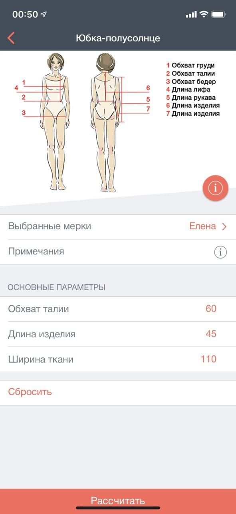
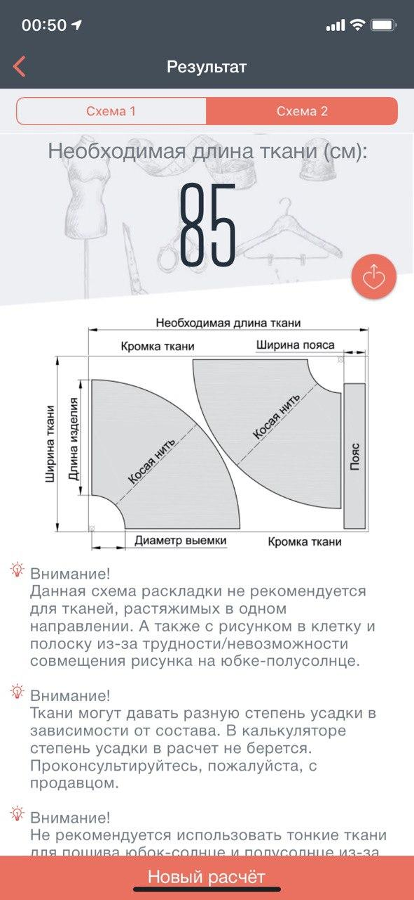
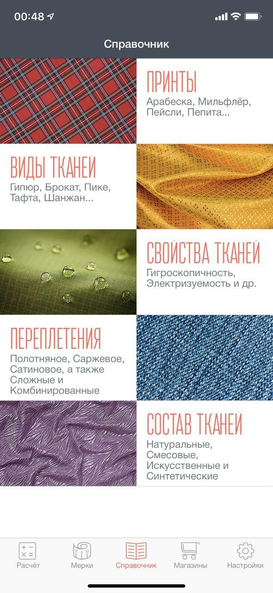
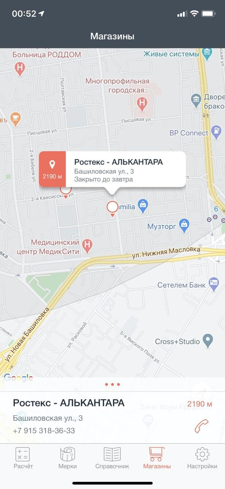
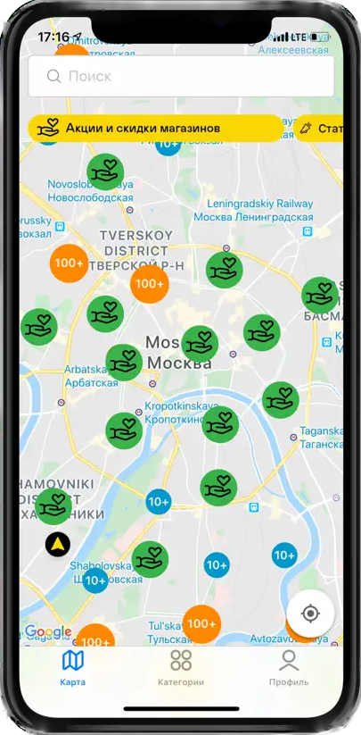
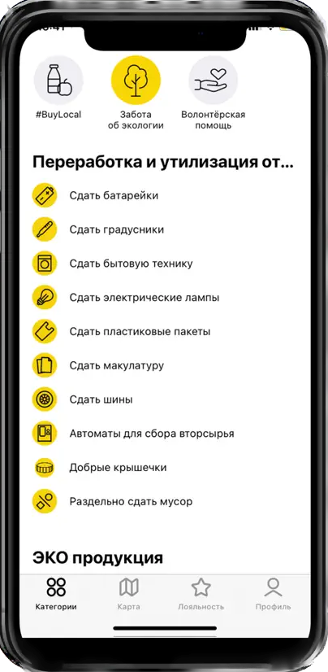
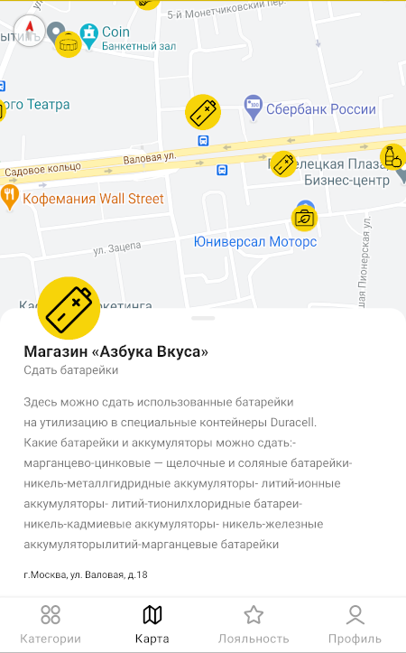
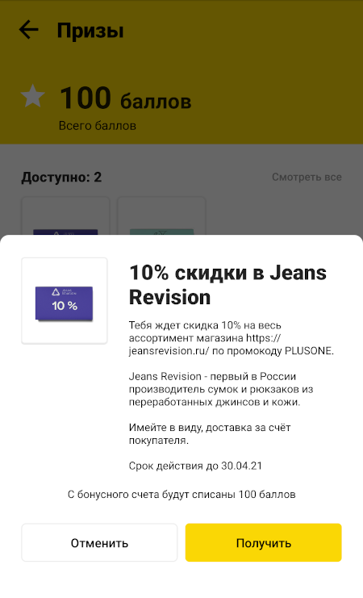
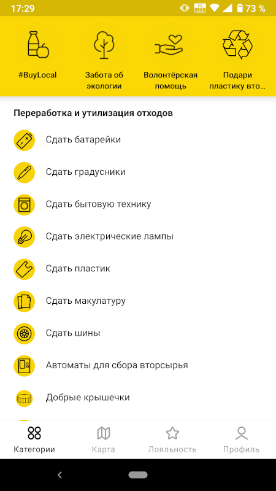

## [Ткань (All about Fabrics)](https://apps.apple.com/ru/app/%D1%82%D0%BA%D0%B0%D0%BD%D1%8C/id1105116327)

Приложение для любителей шитья. Включает в себя:

* Калькулятор расчёта количества материала, необходимого для пошива изделия
* Оффлайн энциклопедия тканей
* Сервис для нахождения ближайших магазинов тканей на карте

Приложение позволяет сохранить метрики различных людей и быстро вставить их в расчёт. Результаты расчёта можно выгрузить и отправить в электронном письме.

Можно считать что «Ткань» — это мой pet-project, написанный в соавторстве с коллегой по работе. Я был единственным разработчиком на этом проекте.

**🪕Роли в проекте: Менеджер, Аналитик, Разработчик, Тестировщик**

**🔨Технологический стэк: Swift, UIKit, MVC, CoreData, Storyboards&Xib, [Google Places API (REST API)](https://developers.google.com/maps/documentation/places/ios-sdk), [Google Maps](https://github.com/googlemaps/ios-maps-sdk)**

## [Dental Plan Pro](https://apps.apple.com/ru/app/dental-plan-pro/id1471044094)

Мобильное приложение для стоматологов. Позволяет быстро составить смету лечения пациента, пока он ещё сидит в кресле. :)
Готовый результат в виде PDF-файла с планом лечения можно выгрузить и отправить пациенту через мессенджер, либо распечатать.
Это успешный стартап. Монетизация осуществляется по подписочной модели. Разработка в составе команды.

**🪕Роли в проекте: Разработчик, Аналитик**

**🔨Технологический стэк: Swift, UIKit, MVVM, [RealmDB](https://github.com/realm/realm-swift), [PinLayout](https://github.com/layoutBox/PinLayout)&[FlexLayout](https://github.com/layoutBox/FlexLayout), StoreKit, [Apphud](https://github.com/apphud/ApphudSDK), [SwiftLint](https://github.com/realm/SwiftLint), [XCoordinator](https://github.com/QuickBirdEng/XCoordinator), DI, Firebase Analytics, Push Notifications, Unit Tests, Генерация PDF**

## [Porotherm Calculator](https://apps.apple.com/ru/app/porotherm-calc/id1584639021)

Cтроительный калькулятор Porotherm. Используя эту программу, вы сможете выбрать такую конструкцию стены из керамических блоков, которая будет наиболее полно удовлетворять требованиям вашего региона по сопротивлению теплопередаче, чтобы в доме круглогодично было тепло и комфортно.
В калькулятор Porotherm встроена возможность расчёта необходимого количества керамических блоков исходя из параметров стен. Так без лишних усилий легко спланировать примерный бюджет на стройку или проверить расчет, который вам подготовила строительная компания. Просто введите все нужные данные, и он посчитает за вас.

**🪕Роли в проекте: Разработчик**

**🔨Технологический стэк: Swift, SwiftUI, Combine, MVVM, [RealmDB](https://github.com/realm/realm-swift), REST API, SwiftLint, [Stinsen](https://github.com/rundfunk47/stinsen)(Coordinator), [Resolver](https://github.com/hmlongco/Resolver)(DI), Firebase Analytics, Unit Tests**

## https://apps.apple.com/ru/app/1%D0%B3%D0%BE%D1%80%D0%BE%D0%B4-%D1%8D%D0%BA%D0%BE-%D0%BA%D0%B0%D1%80%D1%82%D0%B0-%D0%B8-%D0%BD%D0%B0%D0%B2%D0%B8%D0%B3%D0%B0%D1%82%D0%BE%D1%80/id1505256876

+1Город — это интерактивный помощник, который позволяет быстро и просто найти социальные и экологические сервисы в любой точке России.
В одном приложении собраны полезные городские сервисы и мероприятия, которые помогают вести ответственный образ жизни.

**🪕Роли в проекте: Разработчик**

**🔨Технологический стэк: Swift, UIKit, MVVM, [RealmDB](https://github.com/realm/realm-swift), [PinLayout](https://github.com/layoutBox/PinLayout)& [FlexLayout](https://github.com/layoutBox/FlexLayout), REST API, [Google Maps](https://github.com/googlemaps/ios-maps-sdk), SwiftLint, [XCoordinator](https://github.com/QuickBirdEng/XCoordinator), [Resolver](https://github.com/hmlongco/Resolver)(DI), Firebase Analytics, Push Notifications, Unit Tests**

